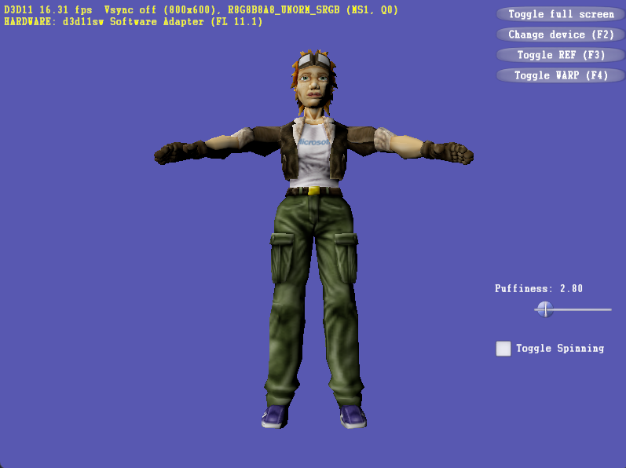
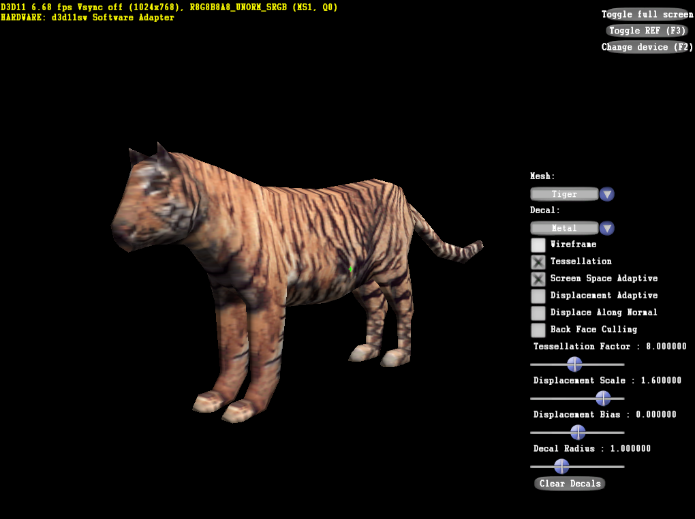
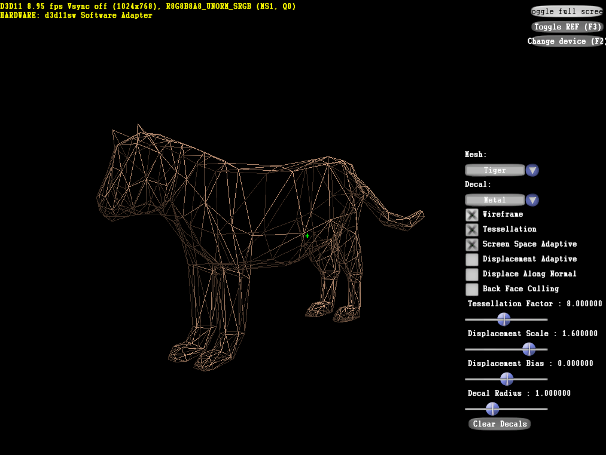

# D3D11SW

A software implementation of the Direct3D 11 API.

## Missing Features

- [ ] Multisampled textures (Currently rendered as 1x)
- [ ] Class linkage
- [ ] Deferred contexts

## Implemented

- [x] Vertex, Pixel, and Compute shaders (JIT: DXBC → C++ → clang++/MSVC)
- [x] Geometry Shader, Stream output, Adjacency topologies, DrawAuto
- [x] Tesselation: Hull Shader, Domain Shader
- [x] SM4.0/SM5.0 instruction set (arithmetic, integer, bitwise, control flow, atomics)
- [x] Tiled rasterizer with 28.4 fixed-point edge functions
- [x] 2x2 quad pixel shader execution (derivatives, auto-LOD)
- [x] BC compressed textures (BC1, BC2, BC3, BC4, BC5, BC7), BC6H still missing
- [x] Texture sampling: 1D/2D/3D/cube, point/bilinear/trilinear, all address modes
- [x] Anisotropic filtering
- [x] Mipmap chains, GenerateMips, SampleLevel/SampleGrad/SampleBias/SampleCmp
- [x] SRGB support
- [x] Depth/stencil with all comparison functions and stencil ops, HiZ
- [x] Blending with all blend factors/ops, dual-source, logic ops
- [x] Multi-render-target, write masks, clip/cull distances
- [x] SV_ViewportArrayIndex, SV_RenderTargetArrayIndex
- [x] Indexed/instanced/indirect draw and dispatch
- [x] TGSM, barriers, thread pool for compute
- [x] Append/consume buffers

## Examples

<b>Screenshots</b>

**Triangle**

    

**Textured Cube**

    
&nbsp;
    

**Instanced Cubes**

    

**Floor (Aliased vs Mipmapped)**

    
&nbsp;
    

**DirectX SDK Samples — Tutorial 10**

    

**DirectX SDK Samples — DecalTessellation11**

    
&nbsp;
    

## Tests

Around 600 tests divided into three categories:
- **Unit tests**: Device, resources, views, states, formats, shader compilation, draw and compute pipelines
- **Golden tests**: Pixel-exact comparison against reference images
- **Perf tests**: Draw and compute benchmarks

## References

- [D3D11.3 Functional Spec](https://microsoft.github.io/DirectX-Specs/d3d/archive/D3D11_3_FunctionalSpec.htm) — rasterization rules, fixed-point precision, LOD calculation, texture filtering
- [D3D11 API Reference](https://learn.microsoft.com/en-us/windows/win32/api/d3d11/) — API contracts, parameter rules, struct/enum definitions
- [Parsing DXBC](https://timjones.io/blog/archive/2015/09/02/parsing-direct3d-shader-bytecode) — DXBC container layout
- `d3d11TokenizedProgramFormat.hpp` (Windows SDK) — opcode definitions, operand encoding, token layout for SM4/SM5 bytecode

