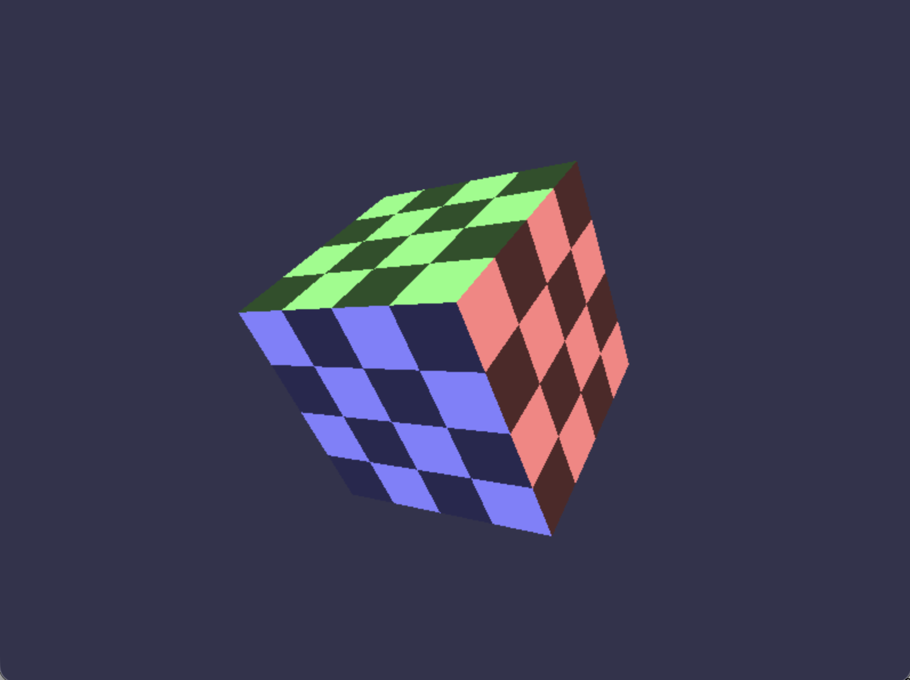
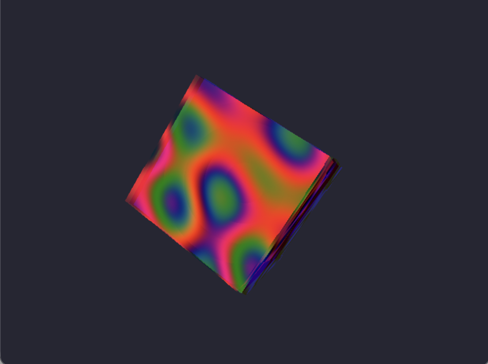
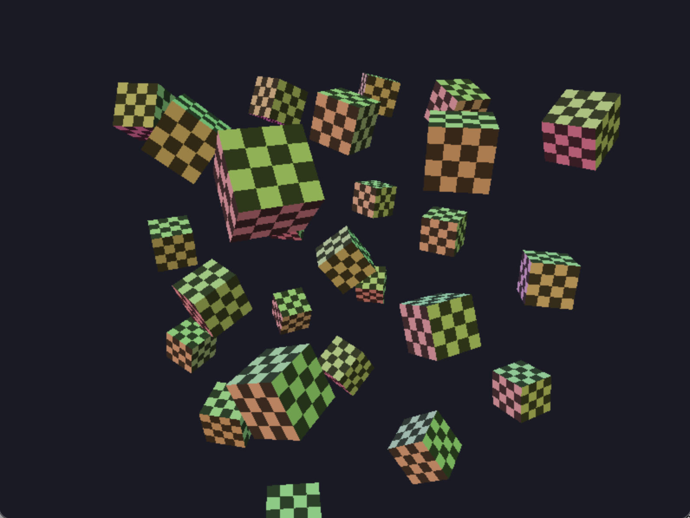
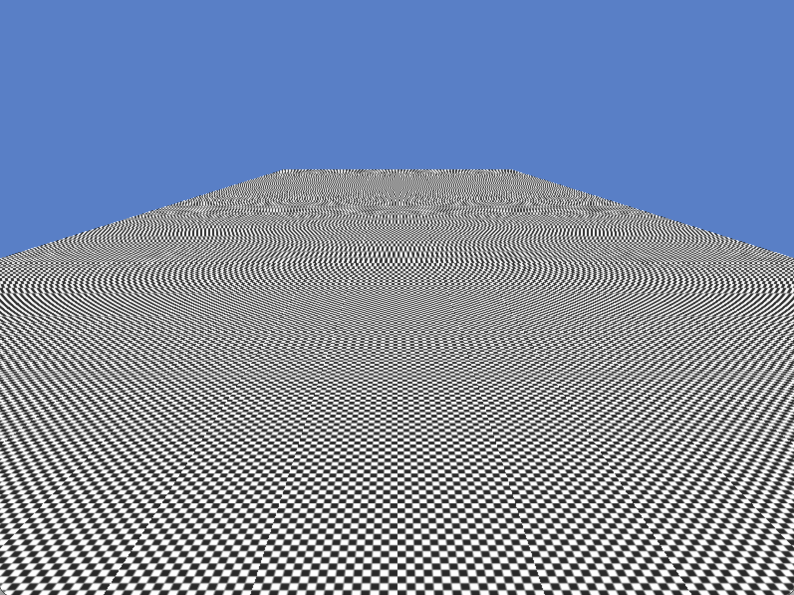
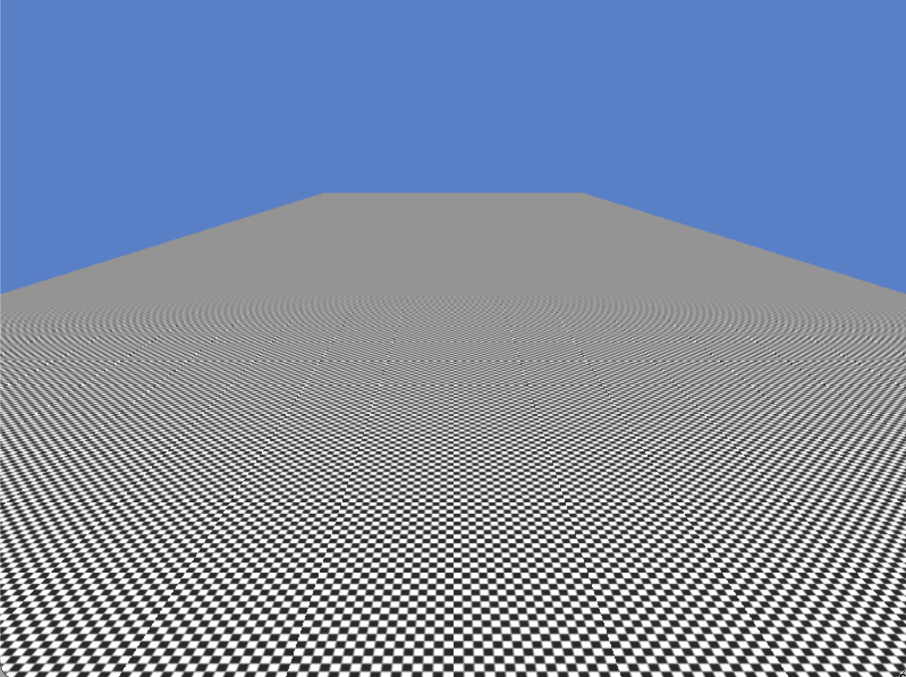

# D3D11SW

A software implementation of the Direct3D 11 API.

## Missing Features

- [ ] BC compressed texture formats (BC1-BC7)
- [ ] Geometry Shader, Stream output, Adjacency topologies
- [ ] Tesselation: Hull Shader, Domain Shader
- [ ] Anisotropic filtering
- [ ] MSAA
- [ ] Deferred contexts

## Implemented

- [x] Vertex, Pixel, and Compute shaders (JIT: DXBC → C++ → clang++/MSVC)
- [x] SM4.0/SM5.0 instruction set (arithmetic, integer, bitwise, control flow, atomics)
- [x] Tiled rasterizer with 28.4 fixed-point edge functions
- [x] 2x2 quad pixel shader execution (derivatives, auto-LOD)
- [x] Texture sampling: 1D/2D/3D/cube, point/bilinear/trilinear, all address modes
- [x] Mipmap chains, GenerateMips, SampleLevel/SampleGrad/SampleBias/SampleCmp
- [x] SRGB support
- [x] Depth/stencil with all comparison functions and stencil ops
- [x] Blending with all blend factors/ops, dual-source, logic ops
- [x] Multi-render-target, write masks, clip/cull distances
- [x] Indexed/instanced/indirect draw and dispatch
- [x] TGSM, barriers, thread pool for compute
- [x] Append/consume buffers

## Examples

<b>Screenshots</b>

**Triangle**

    

**Textured Cube**

    
&nbsp;
    

**Instanced Cubes**

    

**Floor (Aliased vs Mipmapped)**

    
&nbsp;
    

## Tests

Around 600 tests divided into three categoeies:
- **Unit tests**: Device, resources, views, states, formats, shader compilation, draw and compute pipelines
- **Golden tests**: Pixel-exact comparison against reference images
- **Perf tests**: Draw and compute benchmarks

